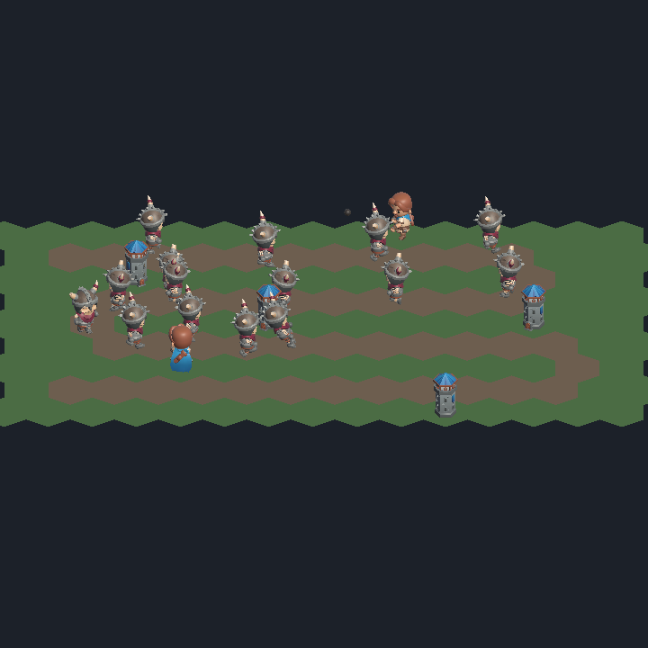

# The sit-down

Twelve things to look at in the build, once, in one sitting.

This is the end of the walking-skeleton slice, and it is the only verification
of scrubbing that survives — the test that scrubbed and compared the result to a
re-simulation was deleted for being a tautology, because it was. What replaces
it is a person dragging a slider and saying whether the legs went backwards.

**Vibes pass, so no row here is allowed to be a vibe.** Every row names the exact
moment to look at and what broken looks like. The moments are tick numbers, and
the tick numbers are not invented here: they come from
[`content/landmarks.txt`](../content/landmarks.txt), which is what a real run of
[`content/match.replay`](../content/match.replay) reported, and the build plays
those exact bytes. That is why this reads "drag to tick 551, then back to tick
520" rather than "hunt for the moment".

## Before you start

```powershell
./tools/build-player.ps1
```

Then double-click `client/Builds/Windows/TowerDefense.exe`.

The controls are the whole interface: **Pause/Play**, a **speed** button that
cycles 1x → 2x → 4x → 8x, **To the end**, and the **scrub bar**. The readout on
the right says which tick is on screen and which tick the match ends on. The
scrub bar is in whole ticks, so nudging it moves the match one tick — that is
how the rows below say "a tick at a time". **Q** and **E**, or the left and
right arrow keys, yaw the camera between its six snaps.

Dragging the scrubber pauses. That is deliberate, and it is not one of the
things being tested.

**Check the readout says the match ends on tick 1852 before you start.** That is
how you know this build is playing the match the rows below are written about,
and it costs a glance. A build playing a match of its own would still look
entirely reasonable — it would just end on a different tick, and every row here
would be pointing a few seconds off.

## The ticks these rows point at

Transcribed from the committed landmark table. It is a second copy of those four
numbers, and it is pinned — but say exactly to what: `SitDownTests` in the build
gate re-runs the recorded match and fails if **this table** and **that run**
disagree. `content/landmarks.txt` is held against the same run, by `LandmarkTests`
and by `tools/run-headless-match.ps1 -Verify`. So the two copies agree because
both are checked against the match itself, and not because either is checked
against the other. A content change that moves a moment turns the gate red rather
than quietly sending somebody to the wrong second.

| landmark | tick | what happens |
|---|---|---|
| `projectile-orphaned` | tick 224 | shell 23 loses the creep it was aimed at, mid-flight |
| `first-overtake` | tick 366 | creep 25 draws ahead of creep 19 |
| `first-leak` | tick 551 | creep 29 reaches the exit |
| `last-creep-dies` | tick 1840 | creep 107, the last one, starts dying |

The match ends on tick 1852. Twelve of forty creeps get through.

## The twelve

| # | Look at | Broken looks like |
|---|---|---|
| 1 | The floor at tick 0, before touching anything | Gaps or overlaps between hexes — grid math wrong |
| 2 | Any model, any tick — tick 366 has skeletons and both kinds of tower on screen at once | **Magenta.** The atlas did not bind — the most common import failure there is |
| 3 | A creep mid-corridor: play to tick 900 and watch one walk | Feet skating, or sunk into / floating above the road surface |
| 4 | **Scrub backwards from the mid-match landmark: drag to tick 551, then drag slowly back to tick 520** | Legs keep walking *forwards* — the view holds its own playback head and the animation bet is lost |
| 5 | Fast-forward: from tick 551, press the speed button through to 8x | Walk cycle does not speed up. Same failure as 4, different symptom |
| 6 | Scrub back across the orphaned shell, which loses its target on tick 224: drag to tick 240, then back to tick 210 | Projectile still flying, or a stuck death pose |
| 7 | Press To the end — tick 1852 — then drag the scrubber to tick 0 | A burst of effects all at once, or particles that never cleared |
| 8 | The projectile tower as it fires: nudge a tick at a time from tick 205 to tick 224 | Fires without playing its clip, or plays it without firing, or does not rotate to face its target |
| 9 | A creep at death: drag to tick 1830 and play at 1x through tick 1840 | Vanishes instantly instead of playing the death clip for the tick duration the simulation gave it |
| 10 | Two creeps overtaking: drag to tick 350 and play at 1x to tick 380, watching for the pass on tick 366 | Draw order flickering, or the pass not visible at all |
| 11 | **Yaw the camera through all six snaps** with Q and E, parked at tick 900 | Anything flips to face you, vanishes, or shows a flat card — the only check on the no-billboards rule |
| 12 | Double-click the build on a clean machine — one that never cloned this repository and has no editor on it | Missing assembly, or a runtime prompt |

## Row 4 is the one worth defending

It is the same failure as row 5, and it is the *visible* one. Row 5 asks whether
a walk cycle sped up, which is a judgement about a thing that is already moving;
row 4 asks whether legs went backwards, which is not a judgement at all.

It is also the only place in the whole suite — every tier of it — where a human
can catch the animation decision being wrong. Nothing else looks at whether the
view holds a playback head of its own. If exactly one row of these twelve gets
looked at properly, it is this one.

## The reference image



**Documentation, explicitly not an oracle.** Nothing compares it to anything and
nothing fails if it changes. It is here so somebody arriving at row 2 with no
idea what the game is supposed to look like has something to compare against by
eye, and for no other purpose.

That call was made deliberately, and it is recorded in
[`docs/frames/README.md`](frames/README.md): two frames whose bones were
definitively swapped rendered pixel-identical, reproducibly, so a screenshot
comparison here would be a check that cannot fail — the species this project
keeps deleting. If this image and the build disagree, believe the build and
regenerate the image.

## What is not being assessed

Not in the bar, and saying so is load-bearing rather than modest:

- Whether it looks good.
- Whether the proportions read.
- Whether the composition is nice.
- Whether it looks like a game.
- **Whether it is fun.** That is a different effort with a different success
  criterion, and this slice is not evidence about it in either direction.

A row above is failed when the thing it names is broken, and not when the thing
it names is ugly.

## Afterwards

The sit-down runs **once**, at the end, in one sitting. It is not a suite, it is
not run per commit, and nothing here is automated later. What each row did is
recorded on
[#48](https://github.com/ssalter21/tower-defense-game/issues/48) rather than
here — this file is the instrument, not the result, and a file that carried both
would be one somebody edited to make green. Anything it catches
that *can* be caught by an assertion should leave behind an assertion — that is
what happened the first time these frames were rendered, when the towers turned
out to be lying on their side and `EveryModelStandsTheWayItWasImported` was
written.
