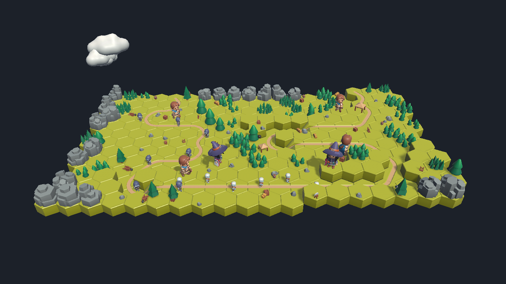

# The sit-down

Twelve things to look at in the build, once, in one sitting.

This is the end of the walking-skeleton slice, and it is the only verification
of scrubbing that survives — the test that scrubbed and compared the result to a
re-simulation was deleted for being a tautology, because it was. What replaces
it is a person dragging a slider and saying whether the legs went backwards.

**Vibes pass, so no row here is allowed to be a vibe.** Every row names the exact
moment to look at and what broken looks like. The moments are tick numbers, and
the tick numbers are not invented here: they come from
[`content/landmarks.txt`](../content/landmarks.txt), which is what a real run of
[`content/match.replay`](../content/match.replay) reported, and the build plays
those exact bytes. That is why this reads "drag to tick 1868, then back to tick
1826" rather than "hunt for the moment".

## Before you start

```powershell
./tools/build-player.ps1
```

Then double-click `client/Builds/Windows/TowerDefense.exe`.

**A build opens on a run's first build phase, and these twelve rows are written about `content/match.replay`.**
Compose a round and press Done and the round you get is a match with the same controls over it, which is what
rows 1, 2, 3, 11 and 12 need — they ask about the floor, the models, the camera and the build itself, and any
match answers them. Rows 4 to 10 name a tick, and the ticks are a tick of the recorded match; a round you
composed is a different match and the readout will say a different final tick. What to do about those seven is
[an open question](open-questions.md). The reasoning in each row is what the row is for and it survives either
answer.

The controls are the whole interface: **Pause/Play**, a **speed** button that
cycles 1x → 2x → 4x → 8x, **To the end**, and the **scrub bar**. The readout on
the right says which tick is on screen and which tick the match ends on. The
scrub bar is in whole ticks, so nudging it moves the match one tick — that is
how the rows below say "a tick at a time". Drag with the **right mouse button**
to orbit the camera, **scroll** to go in and out, **WASD** to fly it across the
board and **E** and **Q** to lift it and drop it — or middle-drag to pan — and
**F** to ease back to the view it started at.

Dragging the scrubber pauses. That is deliberate, and it is not one of the
things being tested.

**Check the readout says the match ends on tick 5302 before you start.** That is
how you know this build is playing the match the rows below are written about,
and it costs a glance. A build playing a match of its own would still look
entirely reasonable — it would just end on a different tick, and every row here
would be pointing a few seconds off.

## The ticks these rows point at

Transcribed from the committed landmark table. It is a second copy of those four
numbers, and it is pinned — but say exactly to what: `SitDownTests` in the build
gate re-runs the recorded match and fails if **this table** and **that run**
disagree. `content/landmarks.txt` is held against the same run, by `LandmarkTests`
and by `tools/run-headless-match.ps1 -Verify`. So the two copies agree because
both are checked against the match itself, and not because either is checked
against the other. A content change that moves a moment turns the gate red rather
than quietly sending somebody to the wrong second.

| landmark | tick | what happens |
|---|---|---|
| `first-overtake` | tick 1096 | creep 23 draws ahead of creep 18 |
| `projectile-orphaned` | tick 637 | shell 21 loses the creep it was aimed at, mid-flight |
| `first-leak` | tick 1868 | creep 31 reaches the exit |
| `last-creep-dies` | tick 5266 | creep 111, the last one, starts dying |

The match ends on tick 5302. Three of forty creeps get through — under the
quarter-to-half band [the roster](roster.md#the-tuning-target) targets, since the
Mage was given the splash it has always been priced for and nothing was retuned
to answer it.

**Row 6 and row 10 are two separate visits.** The orphaned shell and the
overtake are far apart in time as well as in kind, so neither read can stand in
for the other.

## The twelve

| # | Look at | Broken looks like |
|---|---|---|
| 1 | The floor at tick 0, before touching anything | Gaps or overlaps between hexes — grid math wrong |
| 2 | Any model, any tick — tick 1096 has skeletons and both kinds of tower on screen at once | **Magenta.** The atlas did not bind — the most common import failure there is |
| 3 | A creep mid-corridor: play to tick 2700 and watch one walk | Feet skating, or sunk into / floating above the road surface |
| 4 | **Scrub backwards from the mid-match landmark: drag to tick 1868, then drag slowly back to tick 1826** | Legs keep walking *forwards* — the view holds its own playback head and the animation bet is lost |
| 5 | Fast-forward: from tick 1868, press the speed button through to 8x | Walk cycle does not speed up. Same failure as 4, different symptom |
| 6 | Scrub back across the orphaned shell, which loses its target on tick 637: drag to tick 670, then back to tick 610 | Projectile still flying, or a stuck death pose |
| 7 | Press To the end — tick 5302 — then drag the scrubber to tick 0 | A burst of effects all at once, or particles that never cleared |
| 8 | The projectile tower as it fires: nudge a tick at a time from tick 604 to tick 637 | Fires without playing its clip, or plays it without firing, or does not rotate to face its target |
| 9 | A creep at death: drag to tick 5229 and play at 1x through tick 5266 | Vanishes instantly instead of playing the death clip for the tick duration the simulation gave it |
| 10 | Two creeps overtaking: drag to tick 1060 and play at 1x to tick 1130, watching for the pass on tick 1096 | Draw order flickering, or the pass not visible at all |
| 11 | **Orbit all the way round** by right-dragging, parked at tick 2700; scroll in until one creep fills the screen; fly off the far end of the board with W and drop under it with Q; then press F | Anything flips to face you, vanishes, or shows a flat card — the only check on the no-billboards rule; a model that reads at board distance falling apart up close; W going somewhere other than into the picture after a half turn; or F snapping rather than easing, or landing somewhere other than the view it started at |
| 12 | Double-click the build on a clean machine — one that never cloned this repository and has no editor on it | Missing assembly, or a runtime prompt |

## Rows 4 and 5 are assertions now, and this is why

**They were run, and they came back "hard to tell".** Every other row of the
twelve was called on the first sitting. These two were not, and the reason is
not that the developer did not look — it is that both rows ask whether something
*already in motion* is moving at the right rate, and a walk cycle at thirty hertz
does not hold still to be judged. Row 4 was written believing it asked a
yes-or-no question. In front of the build it turned out to ask a judgement, which
is the thing this file spends its opening paragraph refusing to accept.

So they left behind an assertion, which is what the closing section of this file
says to do. `client/Assets/Tests/PlayMode/LocomotionTests.cs`:

- `ScrubbingBackwardsWalksTheLegsBackwards` — seeks to tick 900, seeks back a
  tick, and requires the creep to stand further back **and** its legs to be
  further back through the cycle.
- `FastForwardCyclesTheLegsWithTheGroundAndNotTheClock` — runs the same half
  second of frames at 1x and at 8x, requires eight times the ticks, and requires
  every walking creep's phase to stay inside the ground it actually covered.

Both rest on one invariant a clock-driven view cannot satisfy: **the walk phase
is what the snapshot's distance says it is**, not what the last frame plus some
elapsed time says.

**They were watched failing.** Feeding `CreepView.Pose` a wall-clock value
instead of the snapshot distance — one argument at `MatchView.DrawCreeps` — turns
exactly these two red and **leaves all seventy other tests green**, which is also
the measurement of what was missing: nothing else in any tier noticed the view
being rewired to a clock. The component seam was already covered
(`PlayablesSamplingTests`, `RealRigSamplingTests`, `PlayableHeadPoisonTests` —
a clip told a time poses at that time, forwards or backwards, and never advances
on its own). What was never covered was the wiring between the match and that
clip, and the wiring is what rows 4 and 5 were looking at.

**What this does not do is retire the rows.** They stay in the twelve. An
assertion knows the phase is right; only a person knows the creep looks like it
is walking. But the load-bearing half — the half where the animation bet is
lost — no longer depends on anyone being able to tell.

## The reference image



**Documentation, explicitly not an oracle.** Nothing compares it to anything and
nothing fails if it changes. It is here so somebody arriving at row 2 with no
idea what the game is supposed to look like has something to compare against by
eye, and for no other purpose.

That call was made deliberately, and it is recorded in
[`docs/frames/README.md`](frames/README.md): two frames whose bones were
definitively swapped rendered pixel-identical, reproducibly, so a screenshot
comparison here would be a check that cannot fail — the species this project
keeps deleting. If this image and the build disagree, believe the build and
regenerate the image.

## What is not being assessed

Not in the bar, and saying so is load-bearing rather than modest:

- Whether it looks good.
- Whether the proportions read.
- Whether the composition is nice.
- Whether it looks like a game.
- **Whether it is fun.** That is a different effort with a different success
  criterion, and this slice is not evidence about it in either direction.

A row above is failed when the thing it names is broken, and not when the thing
it names is ugly.

## Afterwards

The sit-down runs **once**, at the end, in one sitting. It is not a suite, it is
not run per commit, and nothing here is automated later. What each row did is
recorded on
[#48](https://github.com/ssalter21/tower-defense-game/issues/48) rather than
here — this file is the instrument, not the result, and a file that carried both
would be one somebody edited to make green. Anything it catches
that *can* be caught by an assertion should leave behind an assertion — that is
what happened the first time these frames were rendered, when the towers turned
out to be lying on their side and `EveryModelStandsTheWayItWasImported` was
written.

It happened a second time on the first real sitting, and in a more useful way:
rows 4 and 5 were not failed, they were found **unanswerable by eye**, and
`LocomotionTests` is what they left behind. A row that cannot be judged is worth
as much as a row that fails — both mean the check is not where it needs to be.
